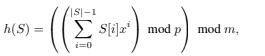

# Лабораторная 6 - Хэш
`(40 * 9 % 50) % 9 = 1`
## Задача 1 - Множество
Необходимо реализовать множество с операциями «добавление ключа», «удаление ключа»,
«проверка существования ключа».

Для этого я реализую хэш-таблицу через списки (хеш-таблицу с открытой адресацией)

- Возьмем простое число, чтобы вычислять хэш (модуль) `MOD = 10**6 + 5`, это также длина нашего списка.
- В каждом элементе нашего списка хранится еще список - цепочка значений с повторяющимся Хэшем
- Таким образом мы можем удалять, добавлять и проверять значения не во всем массиве, а только в одной цепочке, что уменьшает затраты по времени.

Программа:
```python
MOD = 10**6 + 3  # хорошее простое число для размера таблицы

class HashSet:
    def __init__(self):
        self.table = [[] for _ in range(MOD)]

    def _hash(self, x):
        # Можно просто: return x % MOD, но добавим стабилизацию
        x = (x ^ (x >> 16)) % MOD
        return x

    def add(self, x):
        h = self._hash(x)
        if x not in self.table[h]:
            self.table[h].append(x)

    def delete(self, x):
        h = self._hash(x)
        if x in self.table[h]:
            self.table[h].remove(x)

    def exists(self, x):
        h = self._hash(x)
        return x in self.table[h]

def main():
    hs = HashSet()

    with open("input.txt") as file:
        n = int(file.readline())
        for _ in range(n):
            cmd, val = file.readline().strip().split()
            x = int(val)

            if cmd == 'A':
                hs.add(x)
            elif cmd == 'D':
                hs.delete(x)
            elif cmd == '?':
                print('Y' if hs.exists(x) else 'N')
```

## Задание 3 - Хеширование с цепочками

необходимо реализовать хэш таблицу с использованием цепочек и полиминальной хэш-функции

`S[i]` - код ASCII `i`-го символа строки `S`, `p = 1000000007` и `x = 263`. `m` - количество сегментов (входные данные).

Метод вычисления Хэша
```python
def _hash(self, s):
    hash_val = 0
    for i in range(len(s)):
        hash_val += ord(s[i]) * (X ** i)
    return (hash_val % P) % self.m
```

Также необходимо поменять вставку из прошлого задания, чтобы слова вставлялись в начало.
```python
def add(self, x):
    h = self.hash(x)
    if x not in self.table[h]:
        self.table[h].insert(0, x)
```

## Задание 4 - Прошитый ассоциативный массив

Необходимо реализовать словарь, который будет также выполнять функционал двусвязного списка
(доступ к элементам предыдущего и следующего ключа).

Для этого реализуем словарь для хранения значений `self.map = {}`,
а также словарь для доступа к текущей ноде ключа `self.order = {}`.

Также нам необходима информация о `head` и `tail` двусвязного списка

Инициализация класса выглядит так: 
```python
class LinkedMap:
    def __init__(self):
        self.map = {}
        self.order = {}
        self.head = None
        self.tail = None
```

При добавлении добавляем значение в `map` и 
создаем соответствующую ноду для ключа и добавляем ее в конец списка.
Таким образом у нас сохраняется порядок добавления ключей

```python
def put(self, key, value):
    if key in self.map:
        self.map[key] = value
    else:
        self.map[key] = value
        node = Node(key)
        self.order[key] = node
        if self.tail:
            self.tail.next = node
            node.prev = self.tail
            self.tail = node
        else:
            self.head = self.tail = node
```

При удалении также необходимо удалить соответствующую ноду в списке, при этом сохраняя порядок списка.
```python
def delete(self, key):
    if key not in self.map:
        return
    del self.map[key]

    node = self.order.pop(key)
    if node.prev:
        node.prev.next = node.next
    else:
        self.head = node.next

    if node.next:
        node.next.prev = node.prev
    else:
        self.tail = node.prev
```

Таким образом несложно получить `next` и `prev` элементы, зная структуру двусвязного списка
```python
def prev(self, key):
    if key not in self.order:
        return "<none>"
    prev_node = self.order[key].prev
    return self.map.get(prev_node.key) if prev_node else "<none>"

def next(self, key):
    if key not in self.order:
        return "<none>"
    next_node = self.order[key].next
    return self.map.get(next_node.key) if next_node else "<none>"
```

